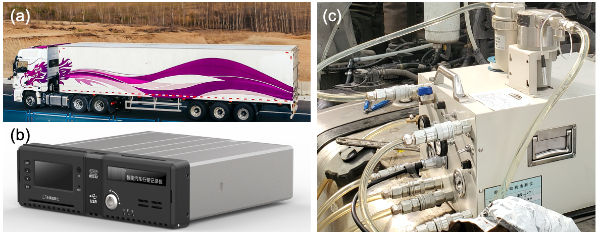

# Fuel Rate Prediction for Heavy-Duty Trucks

This repository contains the open-source dataset used in the paper:

> Liangkai Liu, Wei Li, Dawei Wang, Yi Wu, Ruigang Yang, and Weisong Shi, [Fuel Rate Prediction for Heavy-Duty Trucks](https://www.weisongshi.org/papers/liu23-fuel.pdf), accepted to IEEE Transactions on Intelligent Transportation Systems, March 2023.

The dataset includes sensor data from heavy-duty trucks, which can be used for fuel rate prediction and other research purposes.

## FEAD Dataset Description



The FEAD dataset is collected through Engine Management System (**EMS**) and Instant Fuel Meter (**IFM**) devices. We choose an off-the-shelf CAN bus parser to read fuel consumption from truck's EMS with 10mL measurement resolution and 6.1% - 6.5% error. Regarding the IFM, which provides more accurate fuel measurement, we use [Onosokki's FP-2140H](https://www.onosokki.co.jp/HP-WK/products/keisoku/vehicle/fp\_series.html) fuel meter with 0.1mL measurement resolution and 0.2% error.

The dataset consists of the following data:

- Engine’s status information (engine speed, torque, throttle, fuel rate, etc.) for every 100 milliseconds
- Context information:
  - the truck’s location (province, city, longitude, latitude, etc.)
  - road level (freeway, highway, urban, etc.)
  - truck’s information (vehicle ID, model, etc.)

The data is collected from multiple heavy-duty trucks during different driving conditions and environments. Please refer to the paper for more details.

| **Name**        | **Time** | **Trucks** | **Rows**   | **Features**                                                                   | **Download** |
| :-------------: | :------: | :--------: | :--------: | :-----------------------------------------------------------------------------: | :----------: |
| EMS dataset-1 | 12/2019  | 9          | 10,273,969 | EMS engine data, latitude, longitude, triggertime, city, road level, etc. | [link](https://forms.gle/BBo3BSpRB5yoB7TbA)         |
| EMS dataset-2 | 04/2020  | 29         | 26,145,539 | EMS engine data, latitude, longitude, triggertime, city, road level, etc. | [link](https://forms.gle/BBo3BSpRB5yoB7TbA)         |
| IFM dataset   | 06/2020  | 1          | 872,844    | IFM engine data                                                                 | [link](https://forms.gle/BBo3BSpRB5yoB7TbA)         |


## Citation

If you use this dataset in your research, please cite the following paper:

```bibtex
@article{liu2023fuel,
  title={Fuel Rate Prediction for Heavy-Duty Trucks},
  author={Liu, Liangkai and Li, Wei and Wang, Dawei and Wu, Yi and Yang, Ruigang and Shi, Weisong},
  journal={IEEE Transactions on Intelligent Transportation Systems},
  year={2023},
  month={March}
}