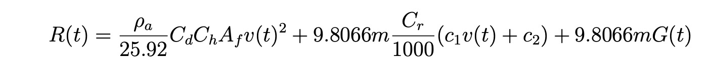
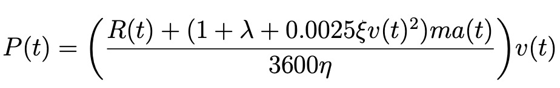
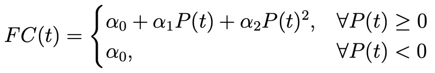

## VT-CPFM (Virginia Tech Comprehensive Power-based Fuel consumption Model)

The VT-CPFM framework uses a bottom-up approach. Namely, the model parameters, including the resistance forces used for power estimation are first computed using
a **resistance force module**; and thereafter the vehicle power is estimated using an **engine power module** that characterizes the vehicle power as a function of the resistance forces. The fuel consumption is finally predicted using a **fuel rate module** that models the fuel consumption as a polynomial function of the vehicle power.

### Resistance Force Module

### Vehicle Power Module

### Fuel Consumption Module

### Results using Dataset-3

KFold = 5 :

R Mean squared error: 223.11
Coefficient of determination: 0.44
median_absolute_error: 152.56
mean value: 388.64
average accuracy: 0.61

R Mean squared error: 284.04
Coefficient of determination: 0.20
median_absolute_error: 212.72
mean value: 333.57
average accuracy: 0.36

R Mean squared error: 257.02
Coefficient of determination: 0.33
median_absolute_error: 184.64
mean value: 373.12
average accuracy: 0.51

R Mean squared error: 264.81
Coefficient of determination: 0.32
median_absolute_error: 188.60
mean value: 363.98
average accuracy: 0.48

R Mean squared error: 400.43
Coefficient of determination: -0.71
median_absolute_error: 221.13
mean value: 254.87
average accuracy: 0.13

**Overall average R2**: 0.11459011114477011

**Overall average accuracy**: 0.4178278821863925
